> [!warning]
> # Obsolete
> **With the latest changes to Discord, they have fixed the issue my program was meant to solve. Which is to allow you to see a discord overlay over any program. Specifically when playing web games such as on Roll20 or FoundryVTT.**

# Discord Overlay

This overlay host is to provide a desktop overlay for when you're playing games in the browser and still want to see who's talking (such as TTRPGs on FoundryVTT or Roll20).

***Requires Windows and .NET v4.5.2 or greater***

## How to Use

### To start the overlay program
|Steps|Images|
|-|-|
|Extract and run the "Discord Overlay.exe" file. [Found in Releases](https://github.com/flamewave000/discord-overlay/releases)|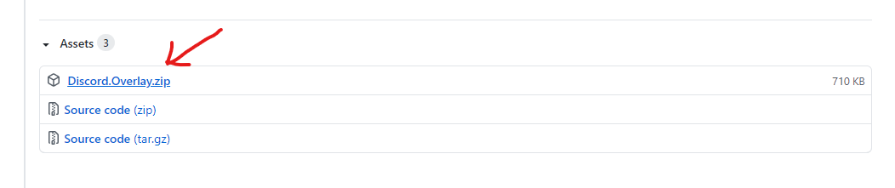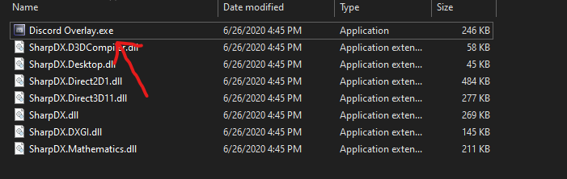|
|Move the "Discord Overlay Host" window somewhere out of the way (but must stay on screen somewhere, even in the background).|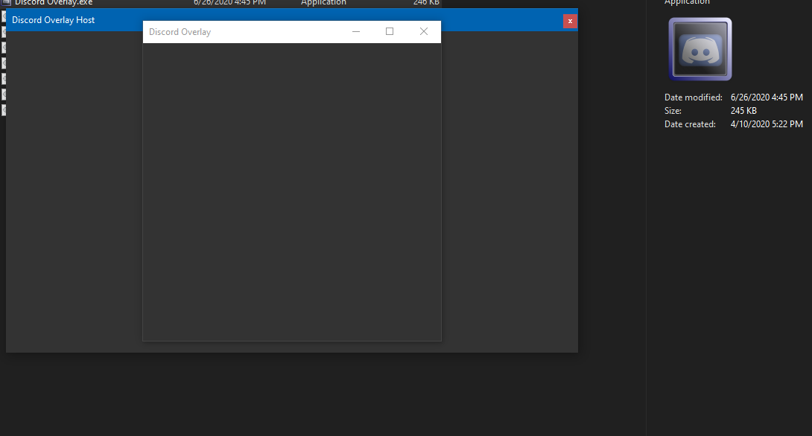|
|Place and resize the "Discord Overlay" window anywhere you want.|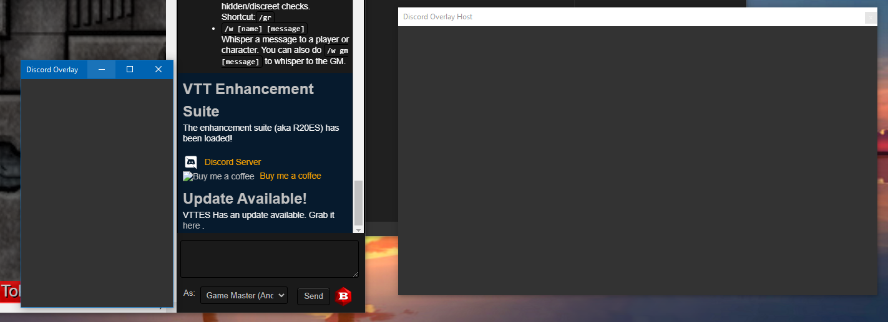|

### To link the overlay with Discord
|Steps|Images|
|-|-|
|Make sure Discord Overlay Host is currently running (see above instructions for downloading and running it).||
|Open Discord's program settings|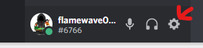|
|Go to the "Overlay" settings and make sure "Enable In-game overlay" is turned on.|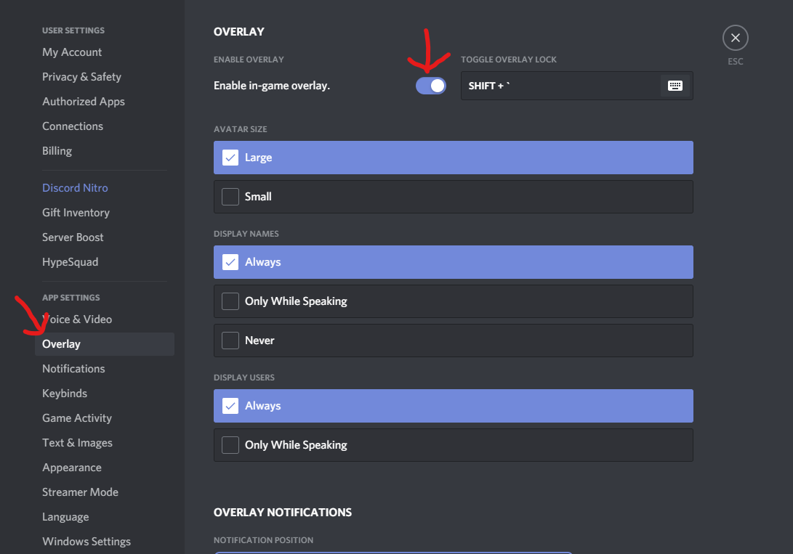|
|Go to the "Game Activity" settings, and click the "Add it!" blue text.||
|Select "Discord Overlay Host" from the dropdown menu|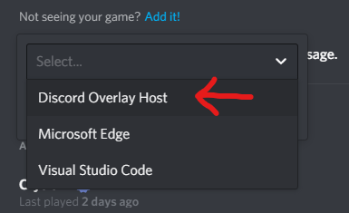|
|Click "Add Game"|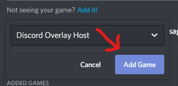|
|You should now see this big green banner, but make sure click the monitor icon on the right to Toggle ON the overlay for the program.|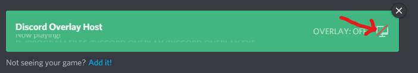|
|Once that is turned on, click the settings close button. After a few moments (be patient) the Discord Overlay program should appear in the Discord Overlay Host and Discord Overlay windows simultaneously.|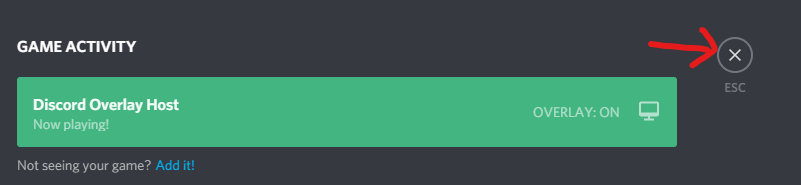|
|JOIN A VOICE CHAT!||
|When EITHER window is FOCUSED, you will be able to see the "Discord Overlay" window and resize it as would any normal window.|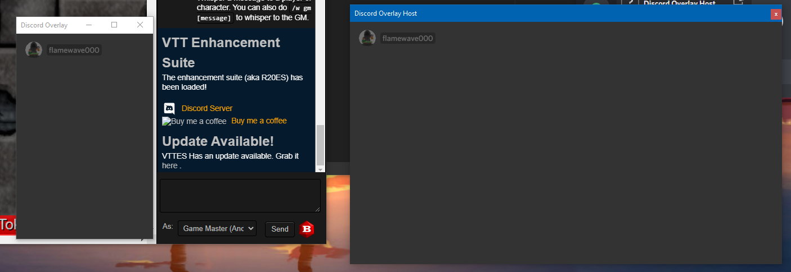|
|But once you UNFOCUS the windows (ie. click on your browser window), the "Discord Overlay" window frame will vanish, and only Discord's overlay content will remain.|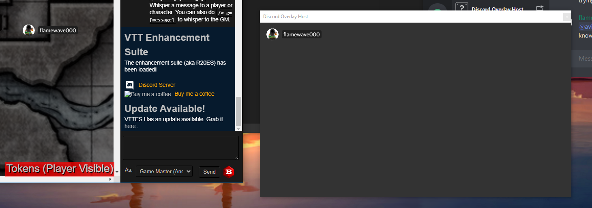|

The Discord Overlay Host window must always be open and NOT minimized, but you can let it get buried by other windows.

**IMPORTANT!** If you need to interact directly with Discord's overlay (such as if Discord is asking you to do something), you may do so using the "Discord Overlay Host" window, *not* the one that vanishes.
